# 🔒 Secure DNS Tunneling with Symmetric Encryption 🔒

A Python-based implementation of a DNS tunnel that uses **AES-256 GCM** to create a secure and covert communication channel. This project is a proof-of-concept demonstrating how to exfiltrate data securely through DNS queries.

-----

## 📊 Architecture Overview

The diagram below illustrates the communication flow between the Agent and the Server.

```mermaid
sequenceDiagram
    participant Agent as 💻 Agent
    participant Server as 🛡️ DNS Server

    Agent->>Agent: 1. Read & Chunk Data
    Agent->>Agent: 2. Encrypt Chunk (AES-GCM)
    Agent->>Agent: 3. Base32 Encode
    Agent->>Server: 4. Send DNS Query<br/>(encoded_chunk.tunnel.example.com)
    Server->>Server: 5. Extract & Base32 Decode
    Server->>Server: 6. Decrypt Chunk (AES-GCM)
    alt ✅ Successful Decryption
        Server-->>Agent: 7. Send ACK<br/>(DNS Response: 1.2.3.4)
    else ❌ Decryption Failed
        Server-->>Agent: 8. No ACK (or error response)
    end
    Agent->>Agent: 9. Receive ACK or Timeout<br/>(Retry if necessary)
```



-----

## 🌟 Core Features

  * **🔒 Secure Communication**: Data is encrypted using military-grade **AES-256 GCM**, ensuring confidentiality and integrity.
  * **🤫 Covert Channel**: Utilizes DNS queries as a hidden communication channel, perfect for bypassing restrictive firewalls.
  * **🔁 Reliable Transmission**: Implements an acknowledgment (ACK) mechanism with automatic retries to ensure data arrives.
  * **🛡️ Data Integrity**: Leverages AES-GCM's built-in authentication tag to verify that data has not been tampered with in transit.
  * **📦 Smart Chunking**: Automatically splits large messages or files into smaller chunks for transmission and reassembles them on the server.
  * **🔢 Sequence Numbering**: Embeds a sequence number in each chunk to guarantee correct message order and prevent replay attacks.

-----

## 🛠️ Setup and Configuration

### Prerequisites

Ensure you have the following installed:

  * 🐍 Python 3.x
  * 📦 `dnspython`
  * 📦 `dnslib`
  * 📦 `pycryptodome`

You can install all dependencies with a single command:

```bash
pip install dnspython dnslib pycryptodome
```

### Project Structure

```
.
├── 📁 agent.py
├── 📁 server.py
├── 📁 crypto_module.py
└── 📄 README.md
```

### Configuration Parameters

All configuration is done via constants at the top of the Python files.

| Parameter | File(s) | Description | Default Value / Example |
| :--- | :--- | :--- | :--- |
| **`SHARED_KEY`** | `agent.py`, `server.py`, `crypto_module.py` | The **32-byte symmetric key**. Must be identical everywhere. | `b"0123...CDEF"` |
| **`DOMAIN`** | `agent.py`, `server.py` | The base domain for the DNS tunnel. | `'tunnel.example.com'` |
| **`CHUNK_SIZE`** | `agent.py` | Max size (in bytes) of raw data per chunk. | `30` |
| **`MAX_RETRIES`** | `agent.py` | Number of send attempts per chunk before failing. | `3` |
| **`SERVER_IP`** | `agent.py`, `server.py` | IP address for the DNS server to run on / connect to. | `'127.0.0.1'` |
| **`SERVER_PORT`**| `agent.py`, `server.py` | Port for the DNS server. | `5353` |

-----

## 🚀 Usage Guide

### 1\. Launch the Server

Open a terminal and run `server.py`. It will start listening for DNS queries.

```bash
python server.py
```

> ```
> 🛡️ DNS Tunnel Server running on 127.0.0.1:5353...
> 📡 Listening for data on domain: tunnel.example.com
> ```

### 2\. Run the Agent

In a **new terminal**, run `agent.py`. It will prompt for your message.

```bash
python agent.py
```

> ```
> Enter your secret message: This is a highly confidential message that will be tunneled over DNS.
> ```

### 3\. Watch the Magic Happen\!

The agent will show its progress, and the server will show received chunks.

\<details\>
\<summary\>\<strong\>Click to see example terminal outputs\</strong\>\</summary\>

**💻 Agent Output:**

> ```
> 🔹 Sending chunk 0, try 1...
> ✅ ACK received for chunk 0
> 🔹 Sending chunk 1, try 1...
> ✅ ACK received for chunk 1
> 🔹 Sending chunk 2, try 1...
> ✅ ACK received for chunk 2
> ✨ All chunks sent and acknowledged successfully!
> ```

**🛡️ Server Output:**

> ```
> ✅ Received chunk 0: b'This is a highly confidentia'
> ✅ Received chunk 1: b'l message that will be tunn'
> ✅ Received chunk 2: b'eled over DNS.'
> ```

\</details\>

### 4\. View the Reconstructed Message

Stop the server (`Ctrl+C`). It will automatically reassemble and display the complete message.

> ```
> ⚠️  Shutting down... rebuilding message:
> ```

> ## \--- Reconstructed Message --- This is a highly confidential message that will be tunneled over DNS.

> ```
> ✅ Received chunks: [0, 1, 2]
> ✅ All chunks received successfully.
>
> ```

-----

## ⚠️ Important Considerations

  * **🚨 Security**: The `SHARED_KEY` is hardcoded for this example. In a real-world scenario, the key **must not be hardcoded**. Use a secure key exchange mechanism (like Diffie-Hellman) or pre-share it via a secure out-of-band channel.
  * **🌐 Network**: The agent is configured for a local server (`127.0.0.1`). For use over the internet, you must run `server.py` on a public server and configure your domain's NS records to point to that server's IP address.
  * **🕵️ Stealth**: While DNS tunneling can bypass simple firewalls, it is **not invisible**. Network traffic analysis and Intrusion Detection Systems (IDS) can flag the unusual DNS patterns (e.g., high-entropy subdomains, high query frequency) generated by this tool.

